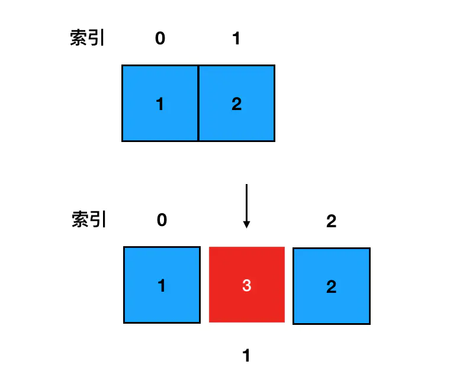

# 数据结构

## 常见的八大数据结构
    1. 数组 Array
    2. 堆栈 Stack
    3. 队列 Queue
    4. 链表 Linked Lists
    5. 树 Trees
    6. 图 Graphs
    7. 字典树 Trie
    8. 散列树（哈希表）Hash Tables
## 具体分析
### 1. 数组
    特点
        最常见的一种数据结构

#### 操作数据的方法
#### 数组中增加元素的方法
- unshift 添加元素到数组的头部
```js
const arr = [1, 2]
arr.unshift(0) // [0, 1, 2]
```
- push 添加元素到数组的尾部
```js
const arr = [1, 2]
arr.push(3) // [1, 2, 3]
```

- splice 添加元素到数组的任何位置
```js
const arr = [1, 2]
arr.splice(1, 0, 3) // [1, 3, 2]
```

    第一个参数是起始的索引值；
    第二个参数表示从起始索引开始要删除的元素个数；
    arr.splice(1, 1),表示从索引1的元素开始，删除掉一个元素，也就是把arr[1]删除掉。
    第三个及以后的参数，用于在删除同时完成，数组的新增，把第三个参数及以后的参数添加到数组里
```js
// eg
const arr = [1, 2]
arr.splice(1, 0, 3, 4) // [1, 3, 4, 2]
```

<!--  -->
#### 数组中删除元素的方法
- shift 删除数组头部的元素
```js
const arr = [1, 2, 3];
arr.shift() // [2, 3]
```
- pop 删除数组尾部的元素
```js
const arr = [1, 2, 3]
arr.pop() // [1, 2]
```
- splice 删除元素任意位置的元素

---
### 2. 堆栈 --- 只用pop和push完成增删的数组
    特点:
        先进后出
        只允许从尾部添加元素 （push）
        只允许从尾部移除元素 （pop）
```js
    class Stack {
        constructor() {}
    }
```
---
### 3. 队列
    特点:
        先进先出
        只允许从尾部添加元素（push）
        只允许从头部移除元素 (shift)

```js
    class Queue {
        constructor() {}
    }
```
---
### 4. 链表
    特点：
        链表是按顺序存储数据元素
        链表不是保留索引，而是指向其他元素
链表与数组相似，他们是有序的列表，都是线性结构（有且仅有一个前驱，有且仅有一个后继）。不同点在于，链表中，数据单位的名称叫做“节点”，而结点与结点的分布，在内存中可以是离散的。

在链表中，每个结点的结构包含两部分的内容：数据域和指针域。js中的链表，是以嵌套对象的形式来实现的。
```js
    {
        // 数据域
        val: 1,
        // 指针域，指向下一个结点
        next: {
            val: 2,
            next: ...
        }
    }
```
#### 4.1 单链表和双链表

 单链表和双链表

#### 4.2 双向链表

### 5. 树
#### 二叉树的遍历
- 先序遍历（根，左，右）
- 中序遍历（左，根，右）
- 后序遍历（左，右，根）
- 层次遍历

按照实现方式的不同，遍历方式分为以下两种
- 递归遍历（先，中，后序遍历）
- 迭代遍历（层次遍历）
**构造二叉树**
```js
function TreeNode(val) {
    this.val = val;
    this.left = null;
    this.right = null;
}
```
生成二叉树

```
const node = new TreeNode(1)
```


**先序遍历**
```js
function preOrder(root) {
    if (!root) return;

    // 输出当前结点
    console.log('当前遍历的结点是：', root.val);
    preOrder(root.left);
    preOrder(root.right);
}
```

**中序遍历**
```js
function midOrder(root) {
    if (!root) return;

    midOrder(root.left);
    console.log(root.val);
    midOrder(root.right);
}
```

**后序遍历**
```js
function postOrder(root) {
    if (!root) return;
    postOrder(root.left);
    postOrder(root.right);
    console.log(root.val);
}
```

### 6. 图

### 7. 字典树
### 8. 散列树


